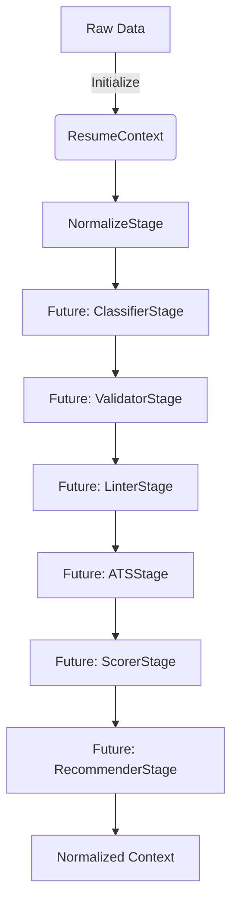

# Resume Intelligence Engine v2

## Overview
This module transforms raw resume data into enterprise-ready, ATS-compliant formats. It executes an isolated pipeline pattern, ensuring all rules, normalization, and validations run deterministically without affecting legacy generation flows.

## Architecture
This application implements the **Pipeline Pattern**. A strongly-typed `ResumeContext` object is initialized with raw input and passed sequentially through multiple `ResumeStage` implementations.



## Public API
The primary entry point is the `ResumePipeline`.

```python
from apps.resume_intelligence import ResumeContext, ResumePipeline

# 1. Initialize Context
context = ResumeContext(resume_data={"job_title": "software engineer"})

# 2. Run Pipeline
pipeline = ResumePipeline()
result_context = pipeline.execute(context)

# 3. Retrieve Data
print(result_context.normalized_data)
print(result_context.errors)
print(result_context.warnings)
```

## Stage Lifecycle
Every stage inherits implicitly from the interface contract:
```python
class ResumeStage:
    def process(self, context: ResumeContext) -> ResumeContext:
        pass
```
- A stage **MUST NOT** modify the `resume_data` dictionary.
- A stage **MUST** read from or append to `normalized_data`, `errors`, `warnings`, `recommendations`, `metadata`, or `logs`.

## Sprint 1 Status
Currently, only the **NormalizeStage** is implemented, responsible for:
- Whitespace cleanup
- Proper noun capitalization
- Typo correction
- Location normalization
- Degree normalization

## Future Migration Plan
Once all 7 stages are fully implemented and verified via the extensive test suite, we will intercept the PDF generation flow in `apps/pdf_generator/services.py`, replacing the legacy `text_processor.py` and `validators.py` modules with this unified `resume_intelligence` pipeline.
